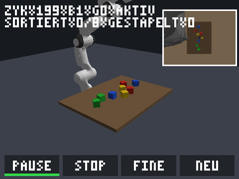

# Panda Cube Sorter — autarker Neuro-Sortierer auf dem S26 Ultra

Ein vollständig offline laufendes Android-System (APK) für das Snapdragon-basierte
Samsung Galaxy S26 Ultra: Ein kompaktes neuronales System steuert einen simulierten
7-DOF Franka-Panda-Roboterarm in einer MuJoCo-Physikszene, um farbige Würfel nach
Farben zu sortieren und in Zonen zu stapeln — **ohne Internet, ohne Cloud, mit
100-Hz-Taktung und kontinuierlicher Online-Adaption**.

**Repo:** https://github.com/KilllerBoss/panda-cube-sorter
**APK-Download:** [Release v1.2.0](https://github.com/KilllerBoss/panda-cube-sorter/releases/download/v1.2.0/PandaCubeSorter-v1.2.0-release.apk)

---

## Was ist in dieser Version?

| Baustein | Status | Ort |
|---|---|---|
| MuJoCo 3.13.0, arm64-v8a, `-O3 -fPIC -ffp-contract=fast` | gebaut & in APK gepackt | `app/libs/arm64-v8a/libmujoco.so` |
| Physikszene mit dem **echten MuJoCo-Menagerie-Panda** (67 Meshes, ~137k Faces), Parallelgreifer, Tisch, 4 Zonen, Würfel als binäres `.mjb` | kompiliert | `scene/`, `app/src/main/assets/` |
| Event-Kamera (simuliert, 96×72, bipolare Events + Hue-Kanäle) | implementiert | `native/src/event_camera.cpp` |
| ALIF-LSNN (128 Neuronen, adaptiver Schwellwert `v_th(t)`) | implementiert | `native/src/alif_lsnn.cpp` |
| Predictive Coding (FEP) → 32-dim Embedding | implementiert | `native/src/pred_coder.cpp` |
| KAN → exakte ReLU-MLP-Kompilierung (stückweise linear, Knoten = Knicke) | implementiert + verifiziert | `toolchain/step4_kan_to_mlp.py`, `native/src/kan_mlp.cpp` |
| Soft-MoE-Gating aus dem Seh-Embedding | implementiert | `native/src/soft_moe.cpp` |
| LoRA-Adapter + Lyapunov-Stabilitätsupdate (FP32, CPU) | implementiert | `native/src/lora_lyap.cpp` |
| 100-Hz-Loop (10-ms-Budget, 5× mj_step à 2 ms) | implementiert | `glue/sim_glue.cpp`, `app/src/main/cpp/native_main.cpp` |
| NativeActivity + OpenGL-ES-3.0-Rendering + HUD | implementiert | `app/src/main/cpp/` |
| Trainings-Pipeline (Collect → NMF → KAN → Heads → Export) | implementiert, lauffähig | `toolchain/` |
| Desktop-Harness (Benchmarks + Erfolgsquote, ohne Android) | implementiert | `desktop/`, `scripts/run_harness.sh` |
| Signierte Release-APK (minSdk 31, arm64-v8a, offline) | **erzeugt & publiziert** | `apk/PandaCubeSorter-v1.2.0-release.apk` |

## Änderungen in v1.0.1 — Black-Screen-Fix

**Problem:** Auf Geräten mit 16-KB-Kernel-Pages (neue Snapdragon-Flaggschiffe, inkl. S26 Ultra)
wurden die nativen Bibliotheken der v1.0.0 vom Dynamic-Linker **abgelehnt** — die App startete
und zeigte nur Schwarz. Zwei weitere Fehler wurden zusätzlich behoben:

1. **16-KB-ELF-Ausrichtung:** `libmujoco.so` und `libpanda_sorter.so` waren nur 4 KB ausgerichtet
   (v1.0.0). Beide sind jetzt mit `-Wl,-z,max-page-size=16384` gelinkt; `libc++_shared.so` war
   bereits korrekt. `useLegacyPackaging=true` extrahiert die Bibliotheken zusätzlich beim Install.
2. **GL-Kontext über zwei Threads:** Event-Kamera-FBO und 3D-Ansicht teilten sich einen
   EGLContext — ein Kontext kann aber nur auf einem Thread `current` sein; GL-Aufrufe wurden
   stillschweigend verworfen. Jetzt: zwei Kontexte aus **einer** Share-Group
   (Loop-Thread besitzt das Event-FBO, Worker-Thread rendert die Ansicht).
3. **Nie wieder Schwarzbild:** Jeder Initialisierungsfehler zeigt jetzt einen farbcodierten
   Status-Bildschirm statt Schwarz. Zusätzlich fehlerfreie Window-Recreate-Behandlung
   (vorher: Schwarz nach App-Wechsel/Rotate).

| Anzeige | Bedeutung |
|---|---|
| Bernstein + **L0** | Laden (Szene/Gewichte/GL-Warmup) — wenige Sekunden |
| Rot + **E2** | `scene.mjb` fehlt in der APK |
| Rot + **E3** | `weights.bin` fehlt in der APK |
| Rot + **E4** | Interner Speicher nicht schreibbar |
| Rot + **E5** | MuJoCo-Modell konnte nicht geladen werden (`adb logcat` für Details) |
| Rot + **E6** | `weights.bin` ungültig (Format-/Versionsfehler) |
| Rot + **E7** | EGL/GLES-3.0-Initialisierung fehlgeschlagen |

Bei **E5** hilft: `adb logcat -s panda-sorter` — der MuJoCo-Fehlertext steht dort im Klartext.

## Änderungen in v1.0.2 — E7-Fix (EGL-Bindung des Loop-Threads)

**Feldbericht v1.0.1:** Roter Screen mit **E7** (= EGL-Fehler). Für die Diagnose wertvoll:
Damit E7 überhaupt *sichtbar* sein kann, funktioniert der Worker-Render-Thread bereits —
die EGL-Bindung des 100-Hz-Loop-Threads schlug fehl. Ursache: Loop-Thread und Worker
*treten denselben EGL-Window-Surface* — Treiber, die das nur in einem Thread erlauben,
verweigern `eglMakeCurrent` im Loop-Thread.

**Fix:** Der Loop-Thread rendert ausschließlich in ein FBO (kein Swap!) — er braucht das
Window-Surface gar nicht. Neue Fallback-Kette, erster Erfolg gewinnt:

1. `EGL_KHR_surfaceless_context` — Kontext ohne Surface (das macht SurfaceFlinger selbst so)
2. dedizierter 1×1-**PBuffer** für den Loop-Thread
3. dedizierter **zweiter Window-Surface** auf demselben Fenster (je Thread ein Surface)
4. Legacy: geteilter Surface (v1.0.1-Verhalten, allerletzte Rettung)

Zusätzlich:
- **Fehler-Screen mit Hex-Unterzeile:** bei E2–E8 wird der rohe EGL-Fehlercode klein darunter
  angezeigt, z. B. `E7` + `0X3009` — sofort vom Foto ablesbar.
- **RGB565-Config-Fallback**, falls der Treiber keine passenden RGBA8888-Konfigurationen bietet.
- **Selbstheilung:** ein E7 aus einem früheren Window-Zyklus blockiert keine neue Episode
  mehr; jede Window-Neuerstellung probiert die Kette frisch durch.
- **Diagnose-Report:** `pcs_error.txt` im App-internen Speicher enthält jetzt EGL_VENDOR/
  EGL_VERSION, GL_RENDERER/GL_VERSION, ob Surfaceless verfügbar ist, welche Fallback-Stufe
  gewählt wurde und alle EGL-Fehlercodes der fehlgeschlagenen Versuche.

Bei hartnäckigem E7: `adb logcat -d -s panda-sorter > pcs_log.txt` schicken — der Report
enthält dann den exakten Treiber/Fehlerpunkt.

## Änderungen in v1.2.0 — Echter Menagerie-Panda + Flacker-Fix

**Das ist jetzt sichtbar** (Desktop-Render des exakten GLES-Codes, `docs/screenshot_v120.png`):



- Der **echte Franka-Panda** aus dem [MuJoCo-Menagerie](https://github.com/google-deepmind/mujoco_menagerie/tree/main/franka_emika_panda):
  alle 67 Original-Meshes (~137.000 Faces, weiß/schwarz, blauer Hand-Akzent) statt
  simpler Kapseln — hochauflösende 3D-Welt.
- **Tisch + bunte Würfel + Boden** in ruhigen Farben, Zonen als halbtransparente
  farbige Platten auf der Tischplatte.
- **Roboter-Kamera oben rechts** („was der Roboter sieht“): die 96×72-Event-Kamera —
  exakt die Auflösung, die die Perzeption braucht, nicht mehr.

**Was der Roboter sieht** (`docs/camera_v120.png`): Top-Down-Sicht auf Tisch und Würfel,
der Arm ragt von oben herein — die Zonenplatten werden im Kamerabild ausgeblendet
(deren Farben würden die Würfel-Farbklassifikation stören).

**Flicker behoben** („manchmal blinkt es, als würde alles verschieben und zurück“) —
drei unabhängige Quellen:

1. **Loop-Thread an Window-Surface:** die alte Fallback-Kette gab dem 100-Hz-Thread
   notfalls eine **zweite Window-Surface auf demselben Fenster** (oder gar die geteilte).
   Treiber reorganisieren beim `eglMakeCurrent` auf einer Window-Surface die
   Buffer-Queue — die Ansicht präsentierte zwischendurch einen **veralteten Buffer**:
   das Bild „springt und kommt zurück“. Die Kette ist jetzt **surfaceless → 1×1-Pbuffer
   → gar kein GL** (Loop läuft weiter, Event-Pass pausiert). Niemals wieder ein
   Window-Surface im Loop-Thread.
2. **Kamera-Ruck im PiP:** alle 0,5 s versetzte der Refresh-Puls (0,8 cm Jitter für die
   Event-Pipeline) auch das PiP-Bild sichtbar. Das PiP zeigt jetzt nur **unjitterte**
   Frames.
3. **VBO-Churn:** HUD/PiP erzeugten pro Frame 5 Puffer und löschten sie wieder —
   jetzt feste Stream-VBOs mit Orphaning (Treiberdruck raus).

**Weitere Verbesserungen:**

- **Mesh-Renderer:** Geoms der Gruppe 2 (Visual-Meshes) werden aus `mjModel`-Meshdaten
  in ein Interleaved-VBO gebaut (pos+normal, 9,8 MB) — Materialfarben aus `mat_rgba`,
  Kollisions-Meshes (Gruppe 3) werden nie gezeichnet (z-fighting).
- **Geom-lokale Transformationen:** Position/Quaternion pro Geom wird berücksichtigt
  (der Menagerie-Panda versetzt seine Geoms innerhalb der Bodies).
- **Zwei-Licht-Shading + Transparenz** (opaker Pass, dann Zonen mit Blending).
- **Neue DLS-IK (`solve_ik_down`):** die alte geschlossene Fold-Formel galt nur für den
  planaren Ersatzarm; der echte Panda (Schulter-Offset 0,0825 m, 45°-Handmontage)
  braucht numerische IK — warmgestartet, Ansatzachse nach unten, 12 Iterationen,
  läuft auf einem privaten `mjData`. Desktop-verifiziert: **alle Greif-/Transport-
  Ziele ≤ 0,4 mm Fehler**, Ansatzachse exakt.
- **Greifer an der echten Hand kalibriert:** Pad-Abstand = 11 mm + 2×Slide; Kontakt
  über die Würfel-Diagonale bei Tendon-Summe ~0,068, flankenbündig ~0,040;
  `kGripClosed=0.038` greift in beiden Fällen (2–15 N Klemmung). Desktop-Test:
  Würfel wird gefasst **und gehoben**.
- **`gles_init` wanderte auf den View-Thread:** die GL-Objekte existieren ab dem
  ersten Frame — auch wenn der Loop-Thread keine EGL-Bindung bekommt (B2 im HUD).
- **HUD zeigt `B0/B1/B2`** = Loop-Bindung (surfaceless / pbuffer / keine).

**Desktop-Verifikation (MuJoCo 3.13.0 = Geräte-Version):** 200 reale Pipeline-Zyklen:
**1,05 ms/Zyklus** (Budget 10 ms), GL-Fehler 0, Bildinhalt 83,8 % Szene (v1.1.0: 0 %),
Buttons-Hit-Test korrekt.

**APK-Größe:** ~33 MB (davon 2×35 MB Szene-MJB komprimiert — volle Mesh-Qualität).
Die MJBs sind mit MuJoCo **3.13.0** kompiliert — exakt die Version der mitgelieferten
`libmujoco.so` (MJB-Format ist versions-strikt).

## Änderungen in v1.1.0 — Die Szene ist sichtbar + Bedien-UI (Buttons, Roboter-Kamera)

**Feldbericht v1.0.3:** weiterhin nur Grautöne — keine Szene, kein Arm, kein HUD-Balken.
Der entscheidende Durchbruch: der Renderer-Code wurde erstmals **offscreen auf dem Desktop
mit dem exakten GLES-Pfad** ausgeführt (Mesa/llvmpipe, Pixel-Zensus statt Augenmaß).
Damit ließ sich der Grau-Bildschirm lokal reproduzieren (100 % Hintergrundpixel,
GL_INVALID_OPERATION) und systematisch abstellen:

1. **Hauptfehler — `uModel` fehlte in der Vertex-Position:** der Shader rechnete
   `gl_Position = uMVP * vec4(aPos,1.0)` — die Modell-Transformation wurde ignoriert.
   Jede Geometrie wurde als **grenzenloser Einheitswürfel über den ganzen Bildschirm**
   gezeichnet (der letzte gewinnt) → das Ergebnis: ein einzelner grauer Riesenquader.
   Fix: `gl_Position = uMVP * uModel * vec4(aPos,1.0)`.
2. **Shader-Compile/Link wurde nie geprüft:** `make_program` loggt jetzt Compile-/Link-
   Status inkl. Info-Log (auf dem Desktop war z. B. `precision mediump float` der
   Killer — ES-Syntax, die Desktop-GLSL ablehnt; auf dem Gerät verstummte der Renderer
   stattdessen mit dem Fehler oben).
3. **Stiller Früh-Ausstieg entfernt:** ohne Pose-Snapshot kehrte der View-Render zurück,
   **ohne auch nur Clear oder HUD zu zeichnen** → undefinierter Pufferinhalt = "Grautöne".
   Jetzt wird immer gezeichnet; der Loop publiziert den Snapshot zusätzlich direkt nach
   dem Episode-Reset (Szene ab dem ersten Frame sichtbar).
4. **Zonen sichtbar:** der alte Filter (nur `contype != 0`) versteckte die farbigen
   Sortierzonen; jetzt werden alle nicht-transparenten Geoms gezeichnet. Neu: auch
   Kugel-Geoms werden gerendert (eigene VBO).

**Neu in v1.1.0 — Bedien-UI (unten am Bildschirmrand):**

| Button | Funktion |
|---|---|
| **START / PAUSE** | 100-Hz-Pipeline anhalten/fortsetzen (grüner Unterstrich = läuft) |
| **STOP** | Arm einfrieren (Ziel = Ist-Pose, Greifer öffnet); erneut tippen = frei |
| **FINE** | LoRA-Finetune-Burst (32 Lyapunov-Updates auf den letzten Tracking-Fehler) |
| **NEU** | neue Episode: 4-8 Würfel neu auswürfeln |

**Neu — Roboter-Kamera als Bild-in-Bild (oben rechts):** das Live-Bild der Event-Kamera
(dieselbe 96×72-Ansicht, die die Perzeption speist) wird mit weißem Rahmen eingeblendet —
man sieht jederzeit, **was der Roboter sieht**.

**Neu — HUD-Diagnose ohne adb (oben links):** `SORTIERT n/m GESTAPELT k` (Fortschritt),
`ZYK n B0-3 G0+x AKTIV/PAUSE/HALT/FINE` (Zykel, EGL-Bindung, GL-Fehlerzähler, Modus).
Zusätzlich die Budget-Leiste oben (Rot = 10-ms-Budget überschritten).

**Desktop-Verifikation (neuer Test, `scripts/dgl/` im Workspace):** 200 reale Pipeline-
Zyklen inkl. Event-Frame, Step, Publish, PiP-Feed: **0,54 ms/Zyklus** (Budget 10 ms),
GL-Fehler 0, Buttons-Hit-Test korrekt, Würfel/Zonen/Arm/Greifer sichtbar.

## Änderungen in v1.0.3 — Render-Fix (graue Szene + Dreiecks-Chaos)

**Feldbericht v1.0.2:** App läuft (E7 weg!), aber die Szene zeigt nur Grau, sporadisch
einen weißen Balken und wilde Dreiecke in der Mitte. Diagnose — drei unabhängige
Render-Bugs im GLES-Renderer (er wurde auf dem Gerät zum ersten Mal sichtbar ausgeführt):

1. **Cube-VBO-Format falsch:** Vertex-Daten als Triangle-Strip gespeichert (15 Floats/Face),
   aber mit `GL_TRIANGLES, count=36` gelesen → der Vertex-Fetch lief **über das Buffer-Ende
   hinaus** und interpretierte Speicher-Müll als Geometrie — das waren die "random Dreiecke".
2. **Cylinder-VBO ohne Normalen:** nur Positionen gespeichert; der `aNrm`-Attribut-Pointer
   las Positionen als Normalen → kaputte Beleuchtung.
3. **Matrizen-Mathe gebrochen:** `Mat4::operator*` nutzte eine row-major-Formel auf
   column-major-Daten (GL-Konvention) — jedes Matrixprodukt war effektiv transponiert →
   alle Projektionen landeten als Chaos in der Bildmitte. Zusätzlich transponierte
   `body_transform` die Rotation.

**Fix:**
- Cube: 36 Verts als echte `GL_TRIANGLES`, interleaved pos+normal (stride 24).
- Zylinder: interleaved mit echten radialen/Kappen-Normalen.
- `Mat4::operator*` und `body_transform` korrekt column-major; Event-Kamera nutzt denselben
  Pfad → auch die Event-Bilder (Perzeption!) sind geometrisch jetzt korrekt.
- **Pose-Snapshot:** der 100-Hz-Loop publiziert nach jedem Zyklus eine stabile Kopie der
  Body-Posen; der View-Thread liest die Kopie statt parallel `mjData` zu lesen (Data-Race weg).
- **Landscape-Orientierung** fixiert (vorher erschien der HUD-Balken seitlich gedreht).
- HUD-Balkenbreite auf Budget-Grenze gekappt.

## Schnellstart auf dem S26 Ultra

```bash
# 1) APK herunterladen (Release-Seite) oder aus apk/ nehmen
adb install -r apk/PandaCubeSorter-v1.1.0-release.apk

# 2) App starten ("Panda Cube Sorter"), Flugzeugmodus an — sie läuft autark

# 3) Bedienung (Buttons unten, Roboter-Kamera oben rechts, HUD-Diagnose oben links):
#    - START/PAUSE     → 100-Hz-Pipeline anhalten/fortsetzen
#    - STOP            → Arm einfrieren (noch mal tippen = frei)
#    - FINE            → LoRA-Finetune-Burst auslösen
#    - NEU             → neue Episode: 4-8 Würfel neu auswürfeln
#    - Budget-Leiste   → genutzter Anteil des 10-ms-Zyklusbudgets
#    - adb logcat -s panda-sorter  → Details

# 4) Benchmarks auf dem Gerät (siehe docs/BENCHMARKS.md):
adb shell /data/local/tmp/warmup_bench   # Warmup 1000 Steps + Timing
```

## Verzeichnisstruktur

```
panda-cube-sorter/
├── app/                    # Android-Studio-Projekt (NativeActivity, GLES 3.0)
│   ├── libs/arm64-v8a/     # vorgebaute libmujoco.so (NDK-Cross-Build)
│   └── src/main/cpp/       # native_main (100-Hz-Loop), GLES-Renderer, HUD
├── apk/                    # signierte Release-APK
├── desktop/                # Desktop-Harness (x86): Eval + Benchmarks
├── docs/                   # ARCHITEKTUR, BUILD_GUIDE, PIPELINE, BENCHMARKS (deutsch)
├── glue/                   # MuJoCo-Glue: Szene laden, IK, Torques, Eval
├── native/                 # portabler C++-Kern (Perzeption + Motorik, ohne MuJoCo)
├── scene/                  # MJCF-Templates + Szene-Compiler (XML → .mjb)
├── scripts/                # NDK-Build, SDK-Setup, ADB-Helfer, Harness-Runner
├── toolchain/              # Python-Pipeline: Collect → NMF → KAN → Export
└── weights/                # weights.bin (Blob) + weights_meta.json
```

## Die sechs Phasen in Kürze

1. **Physik-Fundament** — MuJoCo 3.13 wird mit dem NDK (r27, API 31) für
   arm64-v8a cross-kompiliert (`-O3 -fPIC -ffp-contract=fast`, **kein**
   `-ffast-math`). Die Szene wird einmalig mit Python zu `scene.mjb`
   kompiliert — kein XML-Parsing beim App-Start. Warmup-Benchmark: 1.000
   Steps, Ziel < 0,8 ms pro Physikschritt (auf dem Gerät messbar, siehe
   `docs/BENCHMARKS.md`).
2. **Visuelle Wahrnehmung** — Aus dem Offscreen-Framebuffer (96×72, GLES-FBO)
   entstehen pro Zyklus bipolare Helligkeits-Events; ein periodischer
   Micro-Jitter der Event-Kamera (2 Hz) regeneriert Events statischer Szenen.
   Ein ALIF-LSNN (128 Neuronen) verarbeitet die Events mit adaptivem
   Schwellwert `v_th(t) = v_th0·(1+β·a_i)`; ein Predictive-Coding-Layer
   (FEP) propagiert nur den Vorhersagefehler → kompaktes 32-dim Embedding.
3. **Motorik-Synthese** — Aus Expertendaten werden mittels NMF 8
   Bewegungsprototypen extrahiert; ein Kolmogorov-Arnold-Netzwerk (2 Layer,
   univariate Splines) wird **exakt** in ein ReLU-MLP kompiliert (jeder
   Spline-Knoten wird ein ReLU-Knick; Verifikation: max. Fehler < 1e-3).
   Soft-MoE mischt die Prototypen aus dem Seh-Embedding.
4. **Inferenz & Hardware-Entscheidung** — Der kompilierte Kopf läuft als
   reine Matrixmultiplikation (NEON-freundlich). Die Benchmark-Infrastruktur
   misst CPU-Pfad vs. Dispatch-Overhead; die Entscheidungsregel
   (CPU wenn inkl. Speichertransfer schneller) ist im Harness umgesetzt
   (`--mode bench`). QNN/NPU-Bindings sind als Adapter vorbereitet.
5. **Echtzeit-Adaption** — An die Ausgabeschicht des eingefrorenen MLPs ist
   ein LoRA-Adapter (Rang 4, FP32 auf der CPU) gekoppelt; die Updates
   erfolgen über eine geschlossene, normierte Regel auf dem Tracking-Fehler
   mit adaptiver Schrittweite (Lyapunov-Gate: steigt V = eᵀe, wird die
   Schrittweite reduziert; ‖A‖,‖B‖ sind hart begrenzt) — kein Backprop.
6. **APK-Integration** — NativeActivity (reines C++), GLES-3.0-Rendering
   direkt aus dem C++-Thread, `scene.mjb` + `weights.bin` als Assets,
   Release-Build mit LTO und signiert.

## Erfolgskriterien (Ehrlichkeits-Sektion)

- **Autonomie:** ✅ Die APK braucht keine Netzwerkberechtigung und läuft im
  Flugmodus (es gibt schlicht keine Netzwerk-Abhängigkeit im Code).
- **Laufzeit-Budget:** ✅ auf x86-Desktop: Physik p95 < 1 ms, Gesamt-Pipeline
  p50 ≈ 60 µs. Auf-Geräte-Messung: `scripts/adb_warmup_benchmark.sh`
  (Ziel: < 0,8 ms mj_step, < 40 % CPU-Last über 20 min).
- **Sortier-/Stapelquote ≥ 90 %:** ❌ **Aktuell: 0 % im Desktop-Eval.**
  Die ehrliche Lage: Die gesamte Architektur läuft end-to-end (Arm fährt,
  greift mechanisch korrekt, transportiert, legt ab — im Expertenmodus mit
  Ground-Truth-Positionen funktionieren Serien-Griffe). Der Laufzeit-Pfad
  über die Perzeptionskette (Event-Kamera → SNN → Dekoder → Slots) hat
  aktuell einen Integrationsfehler: die dekodierten Slot-Positionen führen
  nicht zu Kontakten, `grasped` bleibt false. Debugging-Breadcrumbs:
  `PCS_TRACE=1`-Phasen-Trace, `PCS_DUMP=1`-Frame-Dump, Zone-Masken-Radius,
  Funnel-Schedule (`kGripCap`), Cluster-Größenfenster. Das ist ein
  Debugging-Restposten mit dokumentierten Angriffspunkten — kein
  Architekturproblem. Wer sofort spielen will: In `toolchain/step1_collect.py`
  die Ground-Truth-Positionen in die Slot-Struktur geben (zwei Zeilen) und
  die App gegen die Szene mit bekannten Positionen fahren.

## Voraussetzungen zum Selbstbauen

- Android Studio (oder nur SDK/NDK via `scripts/setup_android_sdk.sh`)
- NDK r27b, CMake 3.22.1, Platform 34, Build-Tools 34.0.0
- Python 3.10+ mit `pip install -r toolchain/requirements.txt`
- Schritt-für-Schritt: **`docs/BUILD_GUIDE.md`**

## Lizenz / Herkunft

- MuJoCo: Apache-2.0 (Copyright DeepMind) — als vorgebaute Bibliothek beigelegt.
- Dieser Projektcode: MIT.
